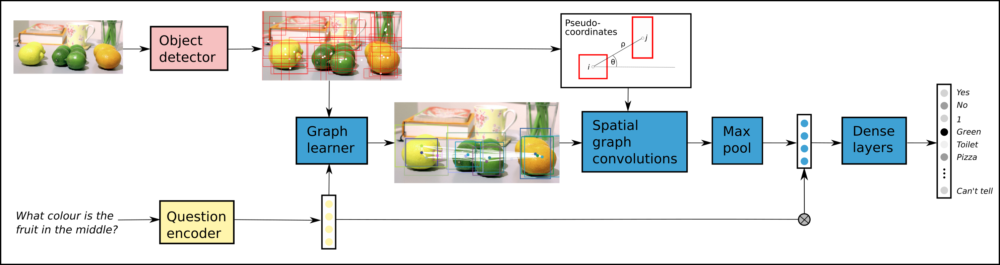
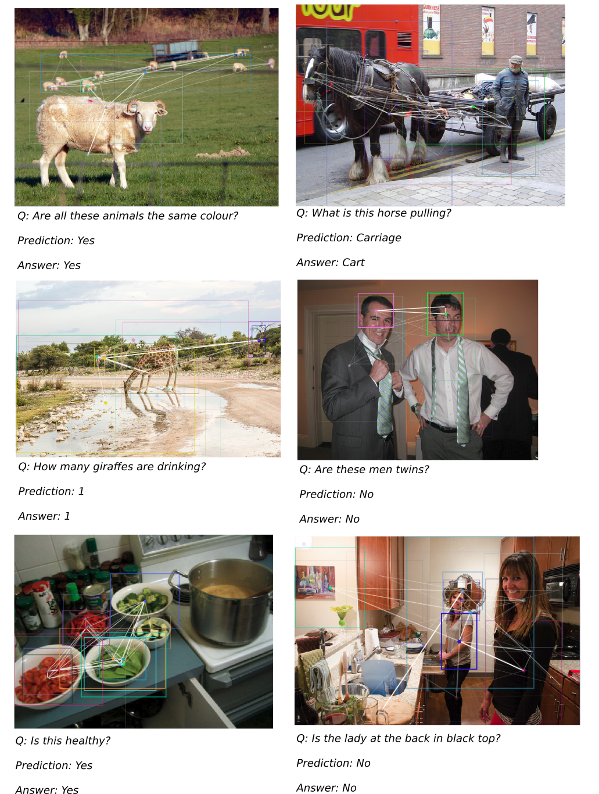

# Learning Conditioned Graph Structures for Interpretable Visual Question Answering

This code provides a pytorch implementation of our graph learning method for Visual Question Answering as described in [Learning Conditioned Graph Structures for Interpretable Visual Question Answering](https://arxiv.org/abs/1806.07243)

### Model diagram

### Examples of learned graph structures


## Getting Started

### Reference

If you use our code or any of the ideas from our paper please cite:
```
@article{learningconditionedgraph,
author = {Will Norcliffe-Brown and Efstathios Vafeias and Sarah Parisot},
title = {Learning Conditioned Graph Structures for Interpretable Visual Question Answering},
journal = {arXiv preprint arXiv:1806.07243},
year = {2018}
}
```

### Requirements

 - [pytorch (0.2.0) (with CUDA)](https://pytorch.org/)
 - [zarr (v2.2.0rc3)](https://github.com/zarr-developers/zarr)
 - [tdqm](https://github.com/tqdm/tqdm)
 - [spacy](https://spacy.io/usage/)

### Data

To download and unzip the required datasets, change to the data folder and run 
 ```
 $ cd data; python download_data.py
 ```

To preprocess the image data and text data the following commands can be executed respectively. (Setting the data variable to trainval or test for preprocess_image.py and train, val or test for preprocess_text.py depending on which dataset you want to preprocess)
```
$ python preprocess_image.py --data trainval; python preprocess_text.py --data train
```
### Pretrained model
If you would like a pretrained model, one can be found here: [example model](https://drive.google.com/open?id=1HqZ6L-pl0AnFyScloFk-ITI6CuPwEMKk). This model achieved 66.2% accuracy on test.


### Training

To train a model on the train set with our default parameters run
```
$ python run.py --train
```
and to train a model on the train and validation set for evaluation on the test set run
```
$ python run.py --trainval
```
Models can be validated via
 ```
$ python run.py --eval --model_path path_to_your_model
```
and a json of results from the test set can be produced with
 ```
$ python run.py --test --model_path path_to_your_model
```
To see a list and description of the model training parameters run
```
$ python run.py --help
```

## Authors

* **Will Norcliffe-Brown**
* **Sarah Parisot**
* **Stathis Vafeias** 


## License

This project is licensed under the Apache 2.0 license - see [Apache license](license.txt)

## Acknowledgements

Our code is based on this implementation of the 2017 VQA challenge winner [https://github.com/markdtw/vqa-winner-cvprw-2017](https://github.com/markdtw/vqa-winner-cvprw-2017)
